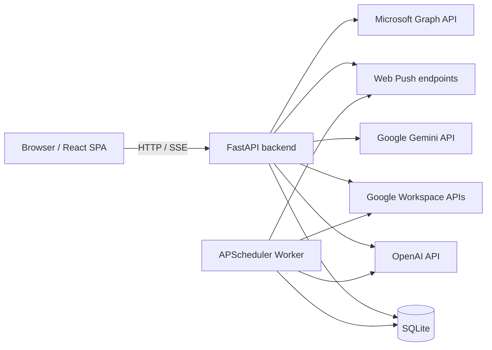
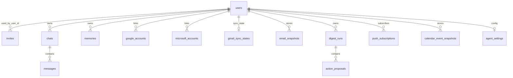
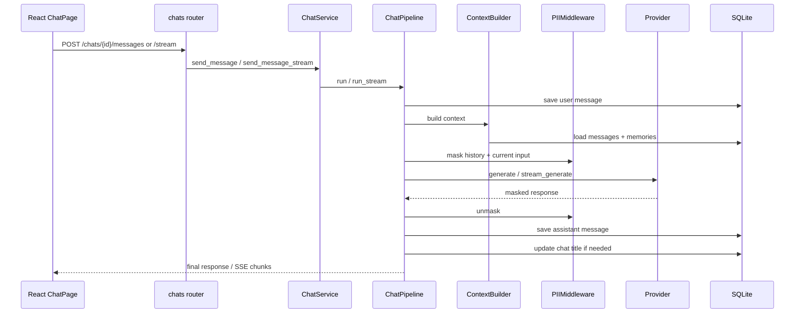
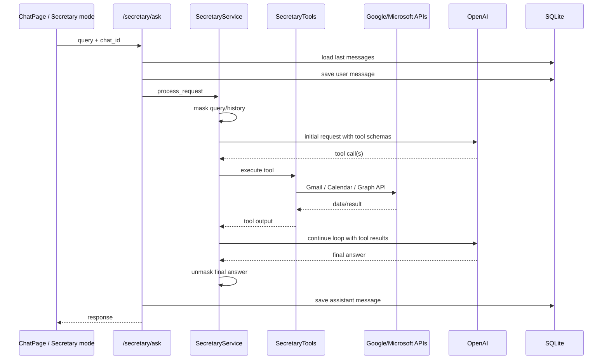
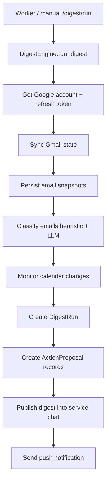
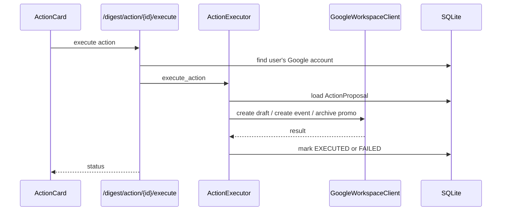
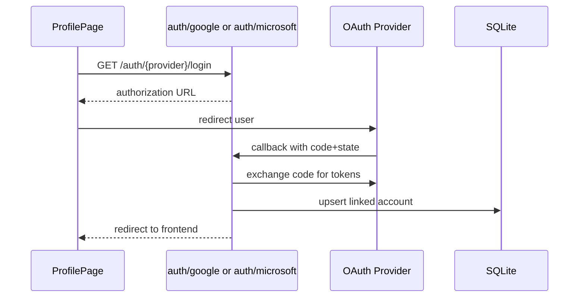

# Claude.md

Повна технічна документація поточного стану проєкту `diploma`.

## 1. Призначення системи

Проєкт реалізує захищений AI-чат із кількома режимами роботи:

- звичайний діалог із LLM;
- потокову генерацію відповіді через SSE;
- Arena Mode для паралельного порівняння двох моделей;
- PII-masking перед передачею даних у зовнішні LLM;
- secretary-agent з tool calling для Gmail/Google Calendar та Microsoft Outlook/Calendar;
- довготривалу пам'ять користувача;
- автоматичні дайджести пошти й календаря;
- web push-сповіщення;
- аудіо-транскрипцію голосового вводу.

Архітектурно це monorepo з двома основними застосунками:

- `backend/` — FastAPI API + worker + SQLite;
- `frontend/` — React/Vite SPA.

## 2. Архітектура верхнього рівня



Ключова ідея системи: користувач взаємодіє з єдиним чат-інтерфейсом, а бекенд оркеструє контекст, маскування PII, вибір провайдера LLM, виконання tool-call сценаріїв, збереження історії та фонові автоматизації.

## 3. Технологічний стек

### 3.1 Backend

- Python 3.x
- FastAPI
- SQLAlchemy 2.x async ORM
- SQLite через `aiosqlite`
- Pydantic / pydantic-settings
- OpenAI SDK
- Google Generative AI SDK
- `httpx` для зовнішніх API
- `python-jose` для JWT
- `bcrypt` для хешування паролів
- `apscheduler` для фонового планувальника
- `pywebpush` для push-сповіщень
- `pypdf` для витягання тексту з PDF

### 3.2 Frontend

- React 18
- TypeScript
- Vite
- Tailwind CSS
- `axios`
- `react-router-dom`
- `lucide-react`
- `recharts`
- Service Worker з `public/sw.js`

### 3.3 Зовнішні інтеграції

- OpenAI Responses API і Chat Completions API
- Google Gemini
- Google OAuth 2.0
- Gmail API
- Google Calendar API
- Microsoft OAuth 2.0
- Microsoft Graph API
- Web Push (VAPID)

## 4. Структура репозиторію

```text
diploma/
├─ backend/
│  ├─ app/
│  │  ├─ core/          # config, database, security, VAPID
│  │  ├─ models/        # ORM-моделі
│  │  ├─ providers/     # OpenAI/Gemini adapters
│  │  ├─ routers/       # HTTP API
│  │  ├─ schemas/       # Pydantic DTO
│  │  ├─ services/      # бізнес-логіка
│  │  │  ├─ chat/       # модульний chat pipeline
│  │  │  └─ pii/        # PII engine/session/types
│  │  ├─ utils/         # pdf, logger, invite helpers
│  │  ├─ main.py        # FastAPI entry point
│  │  └─ worker.py      # планувальник digest jobs
│  ├─ tests/            # pytest-тести
│  └─ *.py              # verify/debug/migration scripts
├─ frontend/
│  ├─ public/sw.js
│  ├─ src/
│  │  ├─ api/
│  │  ├─ components/
│  │  ├─ context/
│  │  ├─ pages/
│  │  ├─ App.tsx
│  │  └─ main.tsx
│  └─ vite.config.ts
├─ README.md
└─ Claude.md
```

## 5. Backend: компоненти та відповідальність

### 5.1 Точки входу

#### `backend/app/main.py`

Відповідає за:

- створення `FastAPI` застосунку;
- CORS для `http://localhost:5173` і `*.ngrok-free.app`;
- логування вхідних HTTP-запитів;
- `Base.metadata.create_all()` на startup;
- автоматичне створення invite-кодів, якщо в БД немає активних;
- підключення роутерів.

Фактично підключені роутери:

- `auth`
- `google_auth`
- `secretary`
- `chats`
- `metrics`
- `memories`
- `audio`
- `digest`
- `notifications`

#### `backend/app/worker.py`

Окремий процес для фонових автоматизацій.

Використовує `AsyncIOScheduler` і створює три типи задач:

- періодичний poll пошти: `POLL_INTERVAL_MINUTES`;
- ранковий дайджест;
- вечірній дайджест.

Worker проходить по всіх користувачах у таблиці `users` і запускає `DigestEngine`.

### 5.2 Конфігурація та інфраструктурні модулі

#### `backend/app/core/config.py`

Головне джерело runtime-конфігурації через `.env`.

Ключові групи налаштувань:

- LLM: `OPENAI_API_KEY`, `GEMINI_API_KEY`
- DB: `DATABASE_URL`
- Chat/memory: `OPENAI_MAX_COMPLETION_TOKENS`, `MEMORY_*`
- Audio: `AUDIO_TRANSCRIBE_MODEL`
- Frontend URL: `FRONTEND_PUBLIC_URL`
- OAuth: `GOOGLE_*`, `MICROSOFT_*`
- Push: `VAPID_*`
- Scheduler: `SCHEDULER_TIMEZONE`, `POLL_INTERVAL_MINUTES`, `MORNING_*`, `EVENING_*`
- PII flags: `PII_V2_ENABLED`, `PII_TOKEN_FORMAT`, `PII_CONTEXTUAL_NUMERIC_IDS`, `PII_STREAM_BUFFERING`

#### `backend/app/core/database.py`

- створює async engine;
- вмикає SQLite `PRAGMA journal_mode=WAL`;
- надає `SessionLocal` та dependency `get_db`.

#### `backend/app/core/security.py`

- перевірка й хешування паролів через `bcrypt`;
- генерація JWT;
- `OAuth2PasswordBearer`.

#### `backend/app/core/model_capabilities.py`

Registry можливостей моделей.

Використовується для:

- вибору між `responses` і `chat_completions` API;
- обліку підтримки tools;
- обмеження `max_output_tokens`;
- перевірки підтримки `temperature`.

### 5.3 LLM layer

#### `backend/app/providers/__init__.py`

`ProviderFactory` — фабрика singleton-провайдерів:

- `openai`
- `gemini`

#### `backend/app/providers/openai_provider.py`

Найважливіший адаптер у системі. Підтримує:

- звичайну генерацію;
- стримінг;
- tool calling;
- обидва OpenAI API-стилі:
  - `responses`
  - `chat.completions`
- ретраї для rate limit / temporary server failures;
- нормалізацію `tool_calls` у JSON-safe формат;
- ланцюжки `previous_response_id`.

#### `backend/app/providers/gemini_provider.py`

Дає доступ до Gemini для:

- звичайної генерації;
- потокової генерації;
- мультимодального контенту через конвертацію `image_url`/`text`.

Gemini у цьому проєкті використовується без tool-calling orchestration.

## 6. HTTP API: роутери та функціональність

### 6.1 Аутентифікація

#### `backend/app/routers/auth.py`

Ендпоїнти:

- `POST /auth/register`
- `POST /auth/login`
- `GET /auth/me`
- `POST /auth/change-password`

Особливості:

- реєстрація invite-only;
- invite-code після успішної реєстрації позначається як використаний;
- логін через `OAuth2PasswordRequestForm`.

### 6.2 Чати

#### `backend/app/routers/chats.py`

Ендпоїнти:

- `POST /chats`
- `GET /chats`
- `GET /chats/{chat_id}`
- `PATCH /chats/{chat_id}`
- `DELETE /chats/{chat_id}`
- `POST /chats/{chat_id}/messages`
- `POST /chats/{chat_id}/messages/stream`
- `POST /chats/{chat_id}/messages/{message_id}/vote`

Ролі:

- CRUD чатів;
- звичайне повідомлення;
- Arena Mode;
- потокова генерація через SSE;
- голосування за відповіді в Arena Mode.

### 6.3 Secretary agent

#### `backend/app/routers/secretary.py`

Ендпоїнти:

- `POST /secretary/ask`
- `GET /secretary/accounts`

Ролі:

- обробка natural-language запитів як agentic workflow;
- читання історії secretary-чату;
- збереження user/assistant повідомлень у звичайну chat-таблицю;
- перегляд підключених Google/Microsoft акаунтів.

### 6.4 OAuth-інтеграції

#### `backend/app/routers/google_auth.py`

Ендпоїнти:

- `GET /auth/google/login`
- `GET /auth/google/callback`
- `DELETE /auth/google/accounts/{account_id}`
- `PATCH /auth/google/accounts/{account_id}`

Функції:

- побудова OAuth URL;
- обмін code на token;
- upsert Google account у БД;
- керування label акаунта.

#### `backend/app/routers/microsoft_auth.py`

Ендпоїнти:

- `GET /auth/microsoft/login`
- `GET /auth/microsoft/callback`
- `DELETE /auth/microsoft/accounts/{account_id}`
- `PATCH /auth/microsoft/accounts/{account_id}`

Функції аналогічні Google, але для Microsoft Graph.

Важливо: модуль реалізований, але зараз не підключений у `app.main`.

### 6.5 Memories

#### `backend/app/routers/memories.py`

Ендпоїнти:

- `GET /memories`
- `POST /memories`
- `DELETE /memories/{memory_id}`

Після create/delete викликається `MemoryChangeNotifier`.

### 6.6 Метрики

#### `backend/app/routers/metrics.py`

Ендпоїнти:

- `GET /metrics`
- `GET /metrics/global`
- `GET /metrics/leaderboard`

Ролі:

- користувацькі recent metrics;
- admin-only global metrics;
- leaderboard за результатами голосувань Arena Mode.

### 6.7 Аудіо

#### `backend/app/routers/audio.py`

Ендпоїнт:

- `POST /audio/transcribe`

Функція:

- приймає `UploadFile`;
- перевіряє MIME type і розмір;
- відправляє у OpenAI transcription model;
- повертає текст транскрипту.

### 6.8 Дайджести

#### `backend/app/routers/digest.py`

Ендпоїнти:

- `POST /digest/run`
- `POST /digest/action/{action_id}/execute`

Функції:

- ручний запуск digest engine;
- виконання запропонованої дії з digest.

### 6.9 Push notifications

#### `backend/app/routers/notifications.py`

Ендпоїнти:

- `GET /notifications/vapid-public-key`
- `POST /notifications/subscribe`

Функції:

- видача публічного VAPID ключа;
- збереження push subscription користувача.

### 6.10 Agent settings

#### `backend/app/routers/agent_settings.py`

Ендпоїнти:

- `GET /agent-settings`
- `PUT /agent-settings`

Поточний стан:

- роутер реалізований;
- фронтенд має helper-и для цього API;
- сам роутер не підключений у `app.main`, тому endpoint фактично недоступний.

## 7. Основні backend-сервіси

### 7.1 `ChatService`

Фасад для роутера чатів.

Відповідає за:

- CRUD чатів;
- перевірку належності чату користувачу;
- виклик звичайного chat pipeline;
- виклик streaming pipeline;
- створення системних повідомлень;
- Arena Mode;
- запис голосу користувача щодо model output.

### 7.2 Модульний chat pipeline

#### `backend/app/services/chat/pipeline.py`

Оркеструє повний життєвий цикл одного повідомлення:

1. зберігає user message;
2. будує system prompt і контекст;
3. обробляє attachments;
4. маскує історію й новий запит;
5. викликає LLM provider;
6. розмасковує відповідь;
7. зберігає assistant message;
8. оновлює title чату, якщо він новий.

#### `context_builder.py`

Формує контекст для LLM:

- бере історію чату;
- обмежує її за кількістю й за символами;
- підтягує memories користувача;
- додає style prompt.

#### `pii_middleware.py`

Wrapper над `PIIService`/`PIISession` для runtime-операцій:

- `mask_history`
- `mask_user_message`
- `unmask`
- `unmask_chunk`
- `flush_unmask_tail`

#### `attachment_processor.py`

Підтримує вкладення:

- PDF: витягає текст через `pypdf`;
- image: передає як `image_url` або data URL;
- інші вкладення: додає як plain text.

#### `transcript_persister.py`

Відповідає за:

- збереження user message;
- збереження assistant message;
- генерацію назви нового чату за першим повідомленням.

### 7.3 PII subsystem

#### `backend/app/services/pii_service.py`

Facade над новим PII v2 engine.

Функції:

- `mask(text) -> masked_text + mapping`
- `unmask(text, mapping)`
- створення `PIISession`

#### `backend/app/services/pii/engine.py`

Regex engine для детекції:

- JWT
- OpenAI keys
- AWS keys
- IBAN
- SWIFT
- банківських карток з Luhn validation
- українських паспортних/id номерів за контекстом
- RNOKPP
- EDRPOU
- email
- phone
- coordinates
- credential-like значень
- address / UA address

Підхід:

- збір кандидатів;
- контекстна фільтрація для неоднозначних numeric IDs;
- розв'язання overlap за `specificity`, довжиною і `priority`.

#### `session.py`

Робота з мапінгом PII token -> original value:

- імпорт/експорт mapping;
- інкрементальна побудова токенів;
- підтримка потокового unmasking з буфером.

### 7.4 Memory subsystem

#### `backend/app/services/memory_service.py`

Відповідає за:

- CRUD long-term memories;
- upsert за `(user_id, category, key)`;
- memory extraction з діалогу через OpenAI;
- memory injection-selection для prompt context;
- forget-by-key;
- background update store після chat reply.

Внутрішні LLM-підсистеми:

- extractor prompt — виділяє стабільні факти;
- injector prompt — відбирає релевантні memories для конкретного повідомлення.

#### `memory_change_notifier.py`

Якщо важлива пам'ять створена або видалена:

- створює/використовує чат `Assistant Updates`;
- додає системне повідомлення;
- надсилає push notification.

### 7.5 Secretary subsystem

#### `backend/app/services/secretary_service.py`

Agent runtime, який:

- маскує PII у history і query;
- формує system prompt із поточним UTC-часом;
- вибирає модель `gpt-5.4-mini` або іншу з settings;
- визначає, який OpenAI API використовувати;
- крутить tool-calling loop до `max_turns`;
- виконує tools через `SecretaryTools`;
- маскує результати tools перед повторною передачею в LLM;
- розмасковує фінальну відповідь.

Підтримує два режими циклу:

- chat completions tool loop;
- responses API tool loop.

#### `backend/app/services/tools_definition.py`

JSON schema опис інструментів:

- листи: list/get/send/reply/forward/delete/read/unread/star/unstar
- календар: list/get/create/update/delete/respond/find_free_slots/get_next_event

#### `backend/app/services/secretary_tools.py`

Concrete implementation tool-функцій.

Особливості:

- резолвить `account_label`;
- кешує список доступних акаунтів на запит;
- підтримує Google і Microsoft;
- оновлює access token, якщо скоро expiry.

### 7.6 Google Workspace / Microsoft Graph clients

#### `google_workspace.py`

Підтримує:

- list/get emails;
- send/create_draft/reply/forward/delete/modify email labels;
- list/get/create/update/delete/respond calendar events;
- find free slots.

#### `microsoft_graph.py`

Підтримує аналогічний контракт:

- list/get/send/reply/forward/delete emails;
- mark read/unread/star через patch полів;
- list/get/create/update/delete/respond calendar events;
- find free slots.

### 7.7 Digest subsystem

#### `backend/app/services/digest_engine.py`

Головний фоновий сервіс автоматизації.

Режими:

- `poll`
- `morning`
- `evening`

Обов'язки:

- інкрементальна або повна синхронізація Gmail;
- збереження email snapshots;
- евристична та LLM-класифікація листів;
- моніторинг змін календаря;
- генерація action proposals;
- створення digest messages у службовому чаті;
- надсилання push-сповіщень.

#### `gmail_sync.py`

Надає два режими синхронізації:

- incremental через history API;
- full sync з lookback window.

#### `action_executor.py`

Виконує запропоновані дії:

- `ARCHIVE_PROMO`
- `CREATE_DRAFT`
- `CREATE_EVENT`

Оновлює статус `ActionProposal` на `EXECUTED` або `FAILED`.

### 7.8 Notifications

#### `notification_service.py`

Відповідає за:

- збереження browser subscriptions;
- розсилку web-push по всіх активних підписках користувача;
- revocation expired subscriptions.

### 7.9 Metrics

#### `metrics_service.py`

Рахує:

- total users/messages;
- total tokens;
- masked messages;
- average latency по останніх assistant-message;
- model usage;
- leaderboard win-rate за Arena Mode.

Метрики збираються з `Message.meta_data`.

## 8. Frontend: архітектура та модулі

### 8.1 App shell

#### `frontend/src/main.tsx`

- монтує React app;
- підключає `BrowserRouter`;
- реєструє `sw.js`.

#### `frontend/src/App.tsx`

Маршрути:

- `/login`
- `/register`
- `/`
- `/chats/:id`
- `/metrics`
- `/admin`
- `/profile`

Використовує `ProtectedRoute`, який покладається на `AuthContext`.

### 8.2 Auth state

#### `frontend/src/context/AuthContext.tsx`

Функції:

- зберігає JWT у `localStorage`;
- під час старту викликає `/auth/me`;
- надає `login`, `logout`, `isAuthenticated`, `isAdmin`.

### 8.3 API client

#### `frontend/src/api/client.ts`

Централізований `axios`-client:

- `baseURL = /api`
- додає `Authorization: Bearer ...`
- логування request/response/error у console

Також тут зібрані:

- TS-типи для chat/user/memory/metrics;
- helper-функції для окремих endpoint-ів.

### 8.4 Основні сторінки

#### `pages/ChatPage.tsx`

Головний інтерфейс продукту.

Функції:

- список чатів і вибір активного;
- створення, перейменування, видалення чатів;
- streaming chat;
- Arena Mode;
- secretary mode;
- optimistic rendering user/assistant messages;
- автоскрол;
- auto-trigger secretary за ключовими словами;
- робота з вкладеннями через `ChatInput`.

#### `pages/ProfilePage.tsx`

Операції користувача:

- перегляд профілю;
- зміна пароля;
- CRUD memories;
- підключення Google/Microsoft акаунтів;
- зміна label або видалення підключеного акаунта;
- перемикач auto-secretary;
- push subscription management.

#### `pages/MetricsPage.tsx`

Відображає:

- total messages;
- avg latency;
- masked count;
- model usage;
- Arena leaderboard.

#### `pages/AdminDashboard.tsx`

Адміністративна аналітика:

- total users;
- total messages;
- masked messages;
- total tokens;
- pie chart model usage.

#### `pages/LoginPage.tsx` / `RegisterPage.tsx`

- логін;
- invite-only реєстрація;
- авто-логін після реєстрації.

### 8.5 Ключові компоненти

#### `components/ChatHeader.tsx`

- перемикання provider/model;
- перемикання Arena Mode;
- вибір стилю відповіді;
- мобільні settings.

#### `components/ChatInput.tsx`

- textarea з auto-resize;
- file attachments;
- voice recording;
- transcription trigger;
- secretary mode toggle;
- send / stop button.

#### `components/MessageBubble.tsx`

Відображення одиночного повідомлення.

#### `components/ArenaMessagePair.tsx`

Відображення пари відповідей двох моделей.

#### `components/Sidebar.tsx`

Навігація між чатами.

#### `components/PushSubscriptionManager.tsx`

Flow push subscription:

- дістає VAPID public key;
- реєструє SW;
- підписується на browser push;
- надсилає subscription у backend.

### 8.6 Frontend networking

#### `frontend/vite.config.ts`

Proxy:

- `/api/* -> http://localhost:8000/*`

З rewrite префікса `/api`.

#### `frontend/public/sw.js`

Service Worker:

- показує нотифікацію з payload;
- відкриває URL із `notification.data.url` по кліку.

## 9. Схема бази даних

### 9.1 Загальний огляд

База даних — SQLite. ORM-моделі створюються автоматично через `create_all()`.

Окремого Alembic-механізму немає. Міграції виконуються:

- або автоматичним `create_all` для нових таблиць;
- або ad-hoc скриптами на кшталт `backend/migrate_db.py`.

### 9.2 ER-схема



### 9.3 Таблиці та призначення

#### `users`

- `id`
- `email` unique
- `hashed_password`
- `is_admin`
- `created_at`

Призначення: локальні акаунти користувачів.

#### `invites`

- `id`
- `code` unique
- `created_at`
- `expires_at`
- `used_at`
- `used_by_user_id -> users.id`
- `is_used`

Призначення: invite-only реєстрація.

#### `chats`

- `id`
- `user_id`
- `title`
- `created_at`
- `updated_at`

Призначення: логічний контейнер діалогу, secretary-chat, assistant-updates, inbox-digest.

#### `messages`

- `id`
- `chat_id -> chats.id`
- `role`
- `content`
- `created_at`
- `meta_data` JSON

`meta_data` використовується для:

- provider/model;
- token usage;
- latency;
- masked flag;
- arena comparison_id;
- vote;
- digest metadata.

#### `memories`

- `id`
- `user_id -> users.id`
- `category`
- `key`
- `value`
- `confidence`
- `created_at`
- `updated_at`

Призначення: довготривала пам'ять користувача.

#### `google_accounts`

- `id`
- `user_id -> users.id`
- `email`
- `label`
- `is_default`
- `access_token`
- `refresh_token`
- `token_expiry`
- `created_at`
- `updated_at`

Призначення: прив'язка Google акаунтів.

#### `microsoft_accounts`

- `id`
- `user_id -> users.id`
- `email`
- `display_name`
- `label`
- `is_default`
- `access_token`
- `refresh_token`
- `token_expiry`
- `tenant_id`
- `created_at`
- `updated_at`

Призначення: прив'язка Microsoft акаунтів.

#### `agent_settings`

- `id`
- `user_id -> users.id` unique
- `custom_instructions`
- `created_at`
- `updated_at`

Призначення: персональні інструкції для агента. Таблиця є, але API поки не підключений до app.

#### `gmail_sync_states`

- `user_id -> users.id` PK
- `last_history_id`
- `last_success_at`
- `error_streak`
- `last_error`
- `full_sync_anchor`

Призначення: стан інкрементальної Gmail-синхронізації.

#### `email_snapshots`

- `id`
- `user_id -> users.id`
- `gmail_message_id`
- `thread_id`
- `sender`
- `recipient`
- `subject`
- `snippet`
- `internal_date`
- `received_at`
- `label_ids` JSON
- `category`
- `has_attachments`
- `attachments_meta` JSON

Призначення: локальний знімок поштових повідомлень для digest-аналітики.

#### `digest_runs`

- `id`
- `user_id -> users.id`
- `period_start`
- `period_end`
- `start_history_id_used`
- `created_chat_id`
- `created_message_id`
- `stats` JSON
- `status`
- `created_at`

Призначення: історія запусків digest engine.

#### `action_proposals`

- `id`
- `digest_id -> digest_runs.id`
- `user_id -> users.id`
- `type`
- `payload_json`
- `status`
- `created_at`
- `updated_at`
- `executed_at`
- `error`

Призначення: пропозиції автоматичних дій, які користувач або система можуть виконати.

#### `push_subscriptions`

- `id`
- `user_id -> users.id`
- `endpoint` unique
- `p256dh`
- `auth`
- `user_agent`
- `created_at`
- `revoked_at`

Призначення: browser push subscriptions.

#### `calendar_event_snapshots`

- `id`
- `user_id -> users.id`
- `event_id`
- `updated_fingerprint`
- `status`
- `last_seen_at`
- `created_at`

Unique constraint:

- `(user_id, event_id)`

Призначення: детекція змін у подіях календаря між запуском digest.

## 10. Потоки даних

### 10.1 Потік звичайного chat-запиту



### 10.2 Streaming flow

Деталі реалізації:

- frontend використовує `fetch`, а не `axios`, для читання `ReadableStream`;
- backend повертає `StreamingResponse` з `text/event-stream`;
- кожний chunk проходить `unmask_chunk`;
- після завершення викликається `flush_unmask_tail`;
- фінальний assistant message зберігається після завершення стриму.

### 10.3 Arena Mode

```mermaid
flowchart TD
    A[ChatPage] --> B[POST /chats/{id}/messages]
    B --> C[ChatService.send_arena_message]
    C --> D[Load chat history]
    C --> E[Mask context once]
    C --> F[Parallel provider.generate for model A and model B]
    F --> G[Assistant message A]
    F --> H[Assistant message B]
    G --> I[Save to DB with comparison_id]
    H --> I
    I --> J[Frontend groups pair by comparison_id]
```

Особливості:

- дві моделі запускаються паралельно;
- обидві відповіді отримують однаковий `comparison_id`;
- голосування записується в `Message.meta_data.vote`.

### 10.4 Secretary agent flow



### 10.5 Memory flow

#### Запис нових memories

1. Користувач надсилає повідомлення.
2. Backend генерує assistant reply.
3. Роутер чатів планує background task `MemoryService.update_store_from_extractor`.
4. Extractor prompt аналізує `user: ... assistant: ...`.
5. `MemoryService` додає або оновлює записи у `memories`.

#### Використання memories у prompt

1. `ContextBuilder` читає всі memories користувача.
2. Відбирає записи з достатньою `confidence`.
3. Додає до system prompt у вигляді facts list.

### 10.6 Digest flow



#### Poll mode

- шукає важливі листи й зміни календаря;
- створює action proposals;
- публікує стислий digest.

#### Morning mode

- формує ранковий план дня;
- бере важливі листи й події сьогодні.

#### Evening mode

- формує підсумок дня;
- додає план на завтра;
- показує pending actions.

### 10.7 Digest action execution



### 10.8 Push notification flow

#### Підписка

1. Frontend реєструє `sw.js`.
2. Отримує `publicKey` з `/notifications/vapid-public-key`.
3. Викликає `registration.pushManager.subscribe`.
4. Відправляє subscription у `/notifications/subscribe`.
5. Backend зберігає `push_subscriptions`.

#### Відправка

1. Digest або `MemoryChangeNotifier` викликає `NotificationService.send_notification`.
2. Сервіс ітерується по активних subscriptions.
3. Через `pywebpush` відправляє payload.
4. Service Worker показує notification.
5. Клік відкриває URL потрібного чату.

### 10.9 OAuth flow



## 11. Поточна реалізація моделей та UX-поведінки

### 11.1 Chat styles

У `ContextBuilder` підтримуються стилі:

- `default`
- `professional`
- `friendly`
- `concise`

Вони реалізовані як різні system prompts.

### 11.2 LLM selection

Frontend дозволяє:

- OpenAI:
  - `gpt-5.4`
  - `gpt-5.4-mini`
  - `gpt-5.4-nano`
- Gemini:
  - `gemini-2.5-flash`
  - `gemini-2.5-flash-lite`

### 11.3 Provider/API behavior

За `ModelRegistry`:

- GPT-5 family працює через OpenAI Responses API;
- інші моделі можуть іти через Chat Completions;
- Gemini обробляється окремим провайдером.

## 12. Конфігураційні та runtime-параметри, критичні для запуску

Мінімально потрібні для core chat:

- `OPENAI_API_KEY`
- `DATABASE_URL`

Для Gemini:

- `GEMINI_API_KEY`

Для Google OAuth / digest:

- `GOOGLE_CLIENT_ID`
- `GOOGLE_CLIENT_SECRET`
- `GOOGLE_REDIRECT_URI` або коректний `FRONTEND_PUBLIC_URL`

Для Microsoft OAuth:

- `MICROSOFT_CLIENT_ID`
- `MICROSOFT_CLIENT_SECRET`
- `MICROSOFT_REDIRECT_URI`
- `MICROSOFT_TENANT_ID`

Для push:

- `VAPID_PRIVATE_KEY`
- `VAPID_PUBLIC_KEY` або можливість обчислення з private key
- `VAPID_CLAIM_EMAIL`

Для worker:

- `SCHEDULER_TIMEZONE`
- `POLL_INTERVAL_MINUTES`
- `MORNING_DIGEST_HOUR`
- `MORNING_DIGEST_MINUTE`
- `EVENING_DIGEST_HOUR`
- `EVENING_DIGEST_MINUTE`

## 13. Тести, verify-скрипти та утиліти

### 13.1 Основні тести

- `backend/tests/test_pii_v2.py`
- `backend/tests/test_secretary_calendar_tools.py`
- `backend/tests/test_secretary_mail_tools.py`
- `backend/tests/test_secretary_service_tools_integration.py`
- `test_pii.py`
- `test_pii_expansion.py`
- `test_auth_flow.py`
- `test_chat_management.py`
- `test_arena_flow.py`

### 13.2 Службові утиліти

- `create_admin_user.py`
- `backend/promote_user.py`
- `backend/generate_vapid_keys.py`
- `backend/migrate_db.py`
- `verify_google_actions.py`
- `verify_microsoft_integration.py`

### 13.3 Практичне значення

Кодова база поєднує:

- pytest-тести;
- одноразові скрипти для smoke/verify;
- debug-скрипти для локального дослідження стану БД чи інтеграцій.

## 14. Відомі технічні особливості та ризики

### 14.1 Не підключені, але реалізовані модулі

- `backend/app/routers/microsoft_auth.py` не включено в `app.main`, хоча frontend має кнопку `Connect Microsoft`.
- `backend/app/routers/agent_settings.py` не включено в `app.main`, хоча frontend має API helper-и для `/agent-settings`.

### 14.2 Безпека

- `backend/app/core/security.py` містить hardcoded `SECRET_KEY = "YOUR_SUPER_SECRET_KEY_CHANGE_THIS"`.
- Це потрібно винести в `.env`.

### 14.3 Міграції

- У проєкті немає Alembic або іншого формального механізму versioned migrations.
- Поточний підхід `create_all + ad-hoc scripts` прийнятний для дипломного/MVP-рівня, але ризиковий для production.

### 14.4 Залежності

- `openai_provider.py` використовує `tenacity`, але в `backend/requirements.txt` ця залежність не задекларована.
- Це може ламати чисте розгортання середовища.

### 14.5 Якість текстових ресурсів

- У README та частині UI/коментарів помітні артефакти кодування.
- Це не впливає прямо на логіку, але впливає на підтримуваність і UX.

### 14.6 Persistence design

- Частина аналітики покладається на `Message.meta_data` JSON у SQLite.
- Для MVP це нормально, але для складних агрегацій і фільтрації це менш ефективно, ніж окремі нормалізовані таблиці або Postgres JSONB.

## 15. Запуск системи

### 15.1 Backend API

```bash
cd backend
pip install -r requirements.txt
uvicorn app.main:app --reload
```

### 15.2 Worker

```bash
cd backend
python -m app.worker
```

### 15.3 Frontend

```bash
cd frontend
npm install
npm run dev
```

## 16. Коротка карта, де шукати зміни

### Якщо треба змінити chat runtime

- `backend/app/services/chat/pipeline.py`
- `backend/app/services/chat/context_builder.py`
- `backend/app/services/chat/pii_middleware.py`
- `backend/app/services/chat/transcript_persister.py`
- `backend/app/services/chat_service.py`

### Якщо треба змінити PII

- `backend/app/services/pii_service.py`
- `backend/app/services/pii/engine.py`
- `backend/app/services/pii/session.py`
- `backend/tests/test_pii_v2.py`

### Якщо треба змінити secretary-agent

- `backend/app/services/secretary_service.py`
- `backend/app/services/secretary_tools.py`
- `backend/app/services/tools_definition.py`
- `backend/app/services/google_workspace.py`
- `backend/app/services/microsoft_graph.py`

### Якщо треба змінити digest automation

- `backend/app/worker.py`
- `backend/app/services/digest_engine.py`
- `backend/app/services/gmail_sync.py`
- `backend/app/services/action_executor.py`

### Якщо треба змінити auth/OAuth

- `backend/app/routers/auth.py`
- `backend/app/routers/google_auth.py`
- `backend/app/routers/microsoft_auth.py`
- `backend/app/services/google_auth_service.py`
- `backend/app/services/microsoft_auth_service.py`

### Якщо треба змінити frontend chat UX

- `frontend/src/pages/ChatPage.tsx`
- `frontend/src/components/ChatInput.tsx`
- `frontend/src/components/ChatHeader.tsx`
- `frontend/src/components/MessageBubble.tsx`
- `frontend/src/components/ArenaMessagePair.tsx`

### Якщо треба змінити profile/push/integrations UX

- `frontend/src/pages/ProfilePage.tsx`
- `frontend/src/components/PushSubscriptionManager.tsx`
- `frontend/public/sw.js`

## 17. Підсумок

Поточний проєкт — це функціонально насичений дипломний AI-асистент із добре вираженими підсистемами:

- chat orchestration;
- PII-protection;
- long-term memory;
- secretary-agent з інструментами;
- digest automation;
- push notifications;
- admin/user analytics.

Сильна сторона архітектури — чітке розділення між роутерами, сервісами, chat pipeline, provider adapters та інтеграційними клієнтами. Основні технічні борги — відсутність формальних міграцій, hardcoded JWT secret, не підключені окремі роутери та кілька інфраструктурних неузгодженостей у залежностях.
