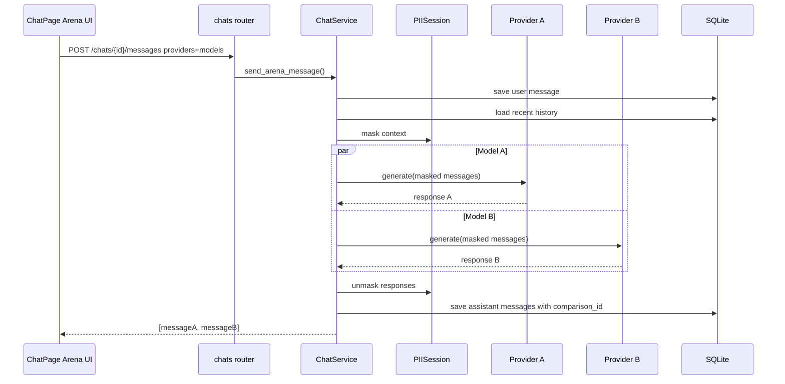
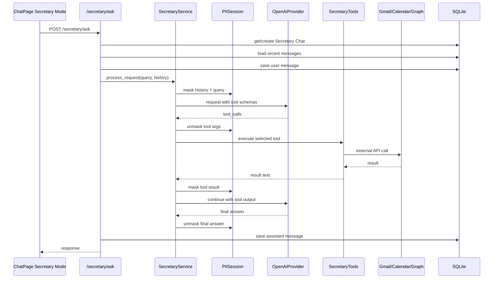
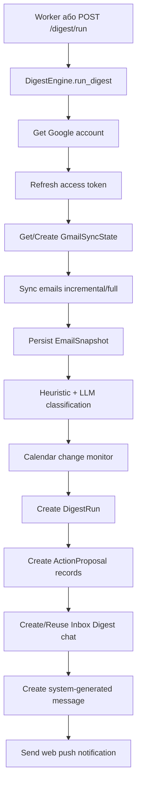
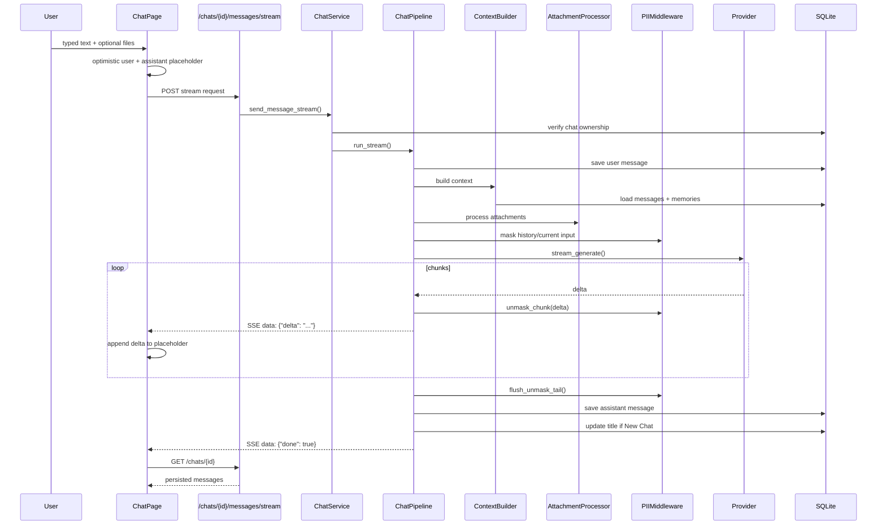
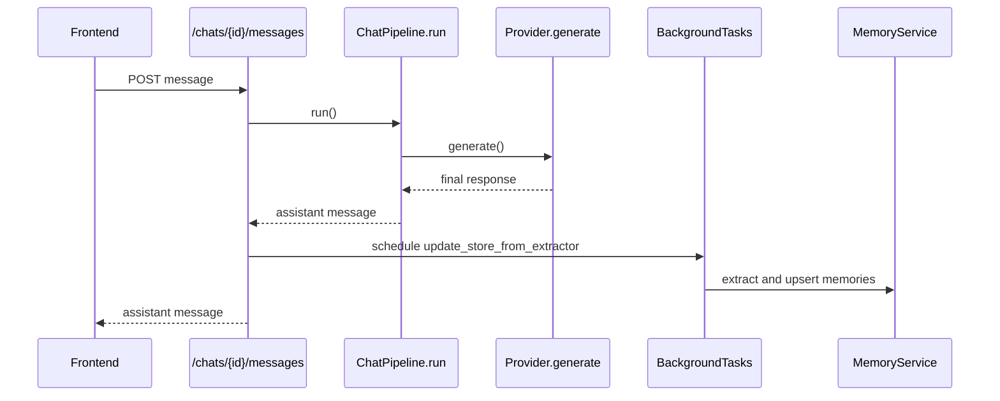
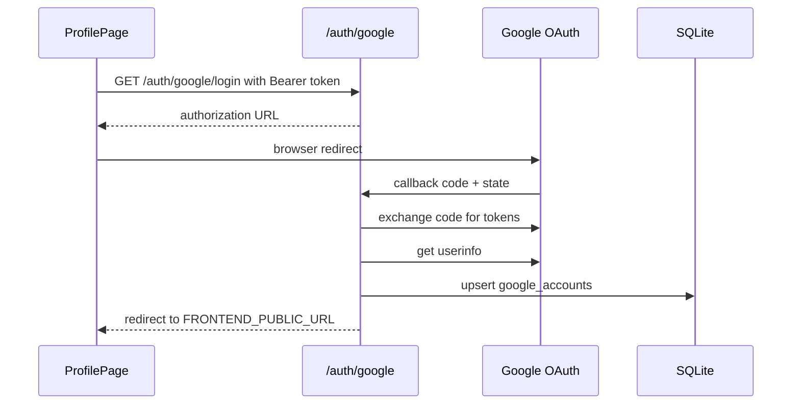
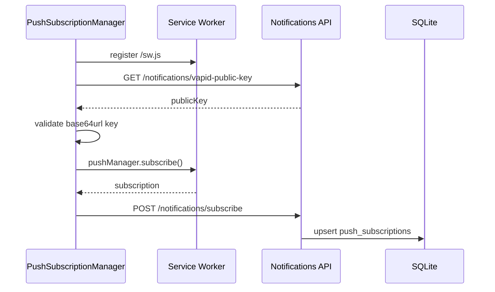

# Технічна документація та специфікація проєкту `diploma`

Дата аналізу: 2026-05-10  
Джерело істини: поточна кодова база репозиторію. Файл `Claude.md` використано як початковий контекст, але фактичні описи нижче звірені з реалізацією в `backend/` та `frontend/`.

## 1. Призначення системи

`diploma` - це monorepo для захищеного AI-чату з інтеграціями пошти, календаря, довготривалої пам'яті, digest-автоматизації та web push-сповіщень.

Система вирішує такі задачі:

- надає користувачу веб-інтерфейс для спілкування з LLM;
- підтримує OpenAI та Google Gemini як LLM-провайдери;
- маскує персональні й чутливі дані перед передачею тексту до LLM;
- повертає користувачу розмасковану відповідь, якщо модель використала PII-токени;
- зберігає історію чатів у SQLite;
- підтримує streaming-відповіді через SSE;
- має Arena Mode для порівняння двох моделей на одному prompt;
- підтримує голосове введення через аудіотранскрипцію OpenAI;
- зберігає довготривалу пам'ять користувача;
- має secretary-agent, який через tool calling працює з Gmail, Google Calendar, Outlook та Microsoft Calendar;
- періодично формує дайджести пошти й календаря через окремий worker;
- створює пропозиції дій за результатами digest і дозволяє виконати їх із UI;
- надсилає web push-сповіщення для digest та важливих змін пам'яті.

## 2. Загальна архітектура

Проєкт складається з двох основних застосунків:

- `backend/` - FastAPI API, сервісний шар, ORM-моделі, інтеграційні клієнти, worker.
- `frontend/` - React/Vite SPA з TypeScript, Tailwind CSS, axios-клієнтом і service worker.

Додатково в корені та backend є verify/debug/test-скрипти для ручної перевірки сценаріїв.

```mermaid
flowchart LR
    User[Користувач у браузері] --> FE[React/Vite SPA]
    FE -->|HTTP JSON через /api proxy| API[FastAPI backend]
    FE -->|fetch ReadableStream| SSE[POST /chats/{id}/messages/stream]
    FE -->|Service Worker Push API| SW[frontend/public/sw.js]

    API --> DB[(SQLite + SQLAlchemy async)]
    API --> OA[OpenAI API]
    API --> GM[Google Gemini API]
    API --> GG[Google OAuth + Gmail + Calendar]
    API --> MS[Microsoft OAuth + Graph]
    API --> WP[Web Push endpoints]

    Worker[APScheduler worker] --> DB
    Worker --> GG
    Worker --> OA
    Worker --> WP
```

### 2.1 Runtime-процеси

API-процес:

```bash
cd backend
uvicorn app.main:app --reload
```

Worker-процес:

```bash
cd backend
python -m app.worker
```

Frontend dev server:

```bash
cd frontend
npm run dev
```

У dev-режимі Vite проксіює всі запити `/api/*` на `http://localhost:8000/*`.

## 3. Структура репозиторію

```text
diploma/
├─ backend/
│  ├─ app/
│  │  ├─ core/          # config, database, JWT/password security, model capabilities, VAPID
│  │  ├─ models/        # SQLAlchemy ORM-моделі
│  │  ├─ providers/     # LLM provider adapters: OpenAI, Gemini
│  │  ├─ routers/       # FastAPI API routers
│  │  ├─ schemas/       # Pydantic DTO
│  │  ├─ services/      # бізнес-логіка
│  │  │  ├─ chat/       # modular chat runtime: context, attachments, PII, persistence, pipeline
│  │  │  └─ pii/        # PII engine/session/types
│  │  ├─ utils/         # PDF extraction, logging, invite utilities
│  │  ├─ main.py        # FastAPI entry point
│  │  └─ worker.py      # APScheduler digest jobs
│  ├─ tests/            # pytest та verify-тести
│  └─ requirements.txt
├─ frontend/
│  ├─ public/sw.js      # service worker для push notifications
│  ├─ src/
│  │  ├─ api/           # axios client + API types/helpers
│  │  ├─ components/    # reusable UI components
│  │  ├─ context/       # AuthContext
│  │  ├─ pages/         # routed pages
│  │  ├─ App.tsx
│  │  └─ main.tsx
│  └─ vite.config.ts
├─ README.md
├─ Claude.md
└─ TECHNICAL_SPECIFICATION_UA.md
```

## 4. Backend: точки входу

### 4.1 `backend/app/main.py`

`main.py` створює FastAPI application:

- назва API: `Secure LLM Chat API`;
- CORS дозволяє `http://localhost:5173`;
- CORS regex дозволяє `https://*.ngrok-free.app`;
- HTTP middleware логує метод, URL, origin і status code;
- на startup викликає `Base.metadata.create_all`;
- на startup генерує 5 invite-кодів, якщо invite-таблиця порожня або всі коди використані;
- підключає роутери:
  - `/auth`;
  - `/auth/google`;
  - `/secretary`;
  - `/chats`;
  - `/metrics`;
  - `/memories`;
  - `/audio`;
  - `/digest`;
  - `/notifications`;
- надає `GET /` і `GET /health`.

Важливо: `microsoft_auth.router` і `agent_settings.router` реалізовані, але не підключені в `main.py`. Через це відповідні endpoint-и фактично недоступні в поточному API-процесі, хоча frontend має виклики до них.

### 4.2 `backend/app/worker.py`

Worker запускає `AsyncIOScheduler` у часовій зоні `SCHEDULER_TIMEZONE`.

Jobs:

- `poll_updates_job` - інтервальний запуск кожні `POLL_INTERVAL_MINUTES`;
- `morning_plan_job` - cron за `MORNING_DIGEST_HOUR` / `MORNING_DIGEST_MINUTE`;
- `evening_summary_job` - cron за `EVENING_DIGEST_HOUR` / `EVENING_DIGEST_MINUTE`.

Кожен job викликає `run_digest_for_all_users(mode)`, який:

- відкриває `SessionLocal`;
- читає всі записи `users`;
- для кожного користувача створює `DigestEngine`;
- запускає `DigestEngine.run_digest(mode=...)`;
- логує результат і продовжує обробку інших користувачів навіть після помилки одного.

## 5. Backend core layer

### 5.1 `core/config.py`

`Settings` базується на `pydantic-settings` і читає `.env`.

Основні налаштування:

| Група | Змінні |
|---|---|
| LLM | `OPENAI_API_KEY`, `GEMINI_API_KEY`, `OPENAI_MAX_COMPLETION_TOKENS` |
| Database | `DATABASE_URL` |
| Memory | `MEMORY_EXTRACT_MODEL`, `MEMORY_INJECT_MODEL`, `MEMORY_EXTRACT_MAX_TOKENS`, `MEMORY_INJECT_MAX_TOKENS` |
| Audio | `AUDIO_TRANSCRIBE_MODEL` |
| Frontend/OAuth redirect | `FRONTEND_PUBLIC_URL` |
| Google OAuth | `GOOGLE_CLIENT_ID`, `GOOGLE_CLIENT_SECRET`, `GOOGLE_REDIRECT_URI` |
| Microsoft OAuth | `MICROSOFT_CLIENT_ID`, `MICROSOFT_CLIENT_SECRET`, `MICROSOFT_REDIRECT_URI`, `MICROSOFT_TENANT_ID` |
| Web Push | `VAPID_PRIVATE_KEY`, `VAPID_PUBLIC_KEY`, `VAPID_CLAIM_EMAIL` |
| Scheduler | `SCHEDULER_TIMEZONE`, `POLL_INTERVAL_MINUTES`, `MORNING_DIGEST_HOUR`, `MORNING_DIGEST_MINUTE`, `EVENING_DIGEST_HOUR`, `EVENING_DIGEST_MINUTE` |
| PII | `PII_V2_ENABLED`, `PII_TOKEN_FORMAT`, `PII_CONTEXTUAL_NUMERIC_IDS`, `PII_STREAM_BUFFERING` |

`get_settings()` кешується через `lru_cache`, тому зміна env після старту процесу не підхоплюється автоматично.

### 5.2 `core/database.py`

Створює:

- async engine через `create_async_engine`;
- `SessionLocal` як `async_sessionmaker`;
- `Base` як `DeclarativeBase`;
- dependency `get_db()`.

Для SQLite на кожному connect виконується:

```sql
PRAGMA journal_mode=WAL
```

Це покращує конкурентність читання/запису для локального SQLite.

### 5.3 `core/security.py`

Функції:

- `verify_password(plain_password, hashed_password)` - bcrypt-перевірка;
- `get_password_hash(password)` - bcrypt-хешування;
- `create_access_token(data, expires_delta=None)` - JWT з `exp`;
- `oauth2_scheme` - `OAuth2PasswordBearer(tokenUrl="auth/login")`.

Параметри:

- алгоритм JWT: `HS256`;
- строк життя access token: 7 днів;
- пароль перед bcrypt обрізається до 72 bytes, бо це обмеження bcrypt.

Технічний ризик: `SECRET_KEY = "YOUR_SUPER_SECRET_KEY_CHANGE_THIS"` захардкоджений у файлі. Для production його потрібно винести в `.env`.

### 5.4 `core/model_capabilities.py`

`ModelRegistry` описує можливості моделей:

- `gpt-5.4-nano`;
- `gpt-5.4-mini`;
- `gpt-5.4`.

Для GPT-5 family:

- `supports_temperature=True`;
- `supports_vision=True`;
- `supports_tools=True`;
- `api_type="responses"`.

Якщо `model_id.startswith("gpt-5")`, registry повертає capabilities для GPT-5.4 nano як fallback. Для `o1*` вимикається temperature/tools і використовується `chat_completions`.

## 6. Модель даних

### 6.1 `users`

ORM: `backend/app/models/user.py`

| Поле | Тип | Опис |
|---|---|---|
| `id` | Integer PK | Ідентифікатор користувача |
| `email` | String unique indexed | Email/login |
| `hashed_password` | String | bcrypt-хеш |
| `is_admin` | Boolean | Ознака адміністратора |
| `created_at` | DateTime | Дата створення |

### 6.2 `invites`

ORM: `backend/app/models/invite.py`

| Поле | Опис |
|---|---|
| `code` | унікальний invite-code |
| `expires_at` | optional expiry |
| `used_at` | час використання |
| `used_by_user_id` | FK на користувача |
| `is_used` | чи код уже використано |

Реєстрація в системі invite-only.

### 6.3 `chats`

ORM: `backend/app/models/chat.py`

| Поле | Опис |
|---|---|
| `id` | PK |
| `user_id` | nullable integer, індекс |
| `title` | назва чату, default `New Chat` |
| `created_at` | дата створення |
| `updated_at` | дата оновлення |

Зв'язок: `Chat.messages` має cascade `all, delete-orphan`.

### 6.4 `messages`

| Поле | Опис |
|---|---|
| `id` | PK |
| `chat_id` | FK на `chats.id` |
| `role` | `user`, `assistant`, `system` |
| `content` | текст повідомлення |
| `created_at` | дата створення |
| `meta_data` | JSON metadata |

`meta_data` використовується для:

- provider/model;
- latency;
- usage/tokens;
- `masked_used`;
- Arena `comparison_id`;
- Arena vote;
- digest actions;
- system-generated marker/source.

### 6.5 `memories`

ORM: `backend/app/models/memory.py`

| Поле | Опис |
|---|---|
| `user_id` | власник пам'яті |
| `category` | `profile`, `preference`, `project`, `constraint`, `other` |
| `key` | короткий ключ |
| `value` | текст значення |
| `confidence` | довіра 0..1 |
| `created_at`, `updated_at` | audit timestamps |

У коді немає DB unique constraint на `(user_id, category, key)`, але `MemoryService.add_memory()` реалізує app-level upsert і видаляє дублікати.

### 6.6 OAuth accounts

`google_accounts`:

- `user_id`;
- `email`;
- `label`, default `personal`;
- `is_default`;
- `access_token`;
- `refresh_token`;
- `token_expiry`;
- `created_at`, `updated_at`.

`microsoft_accounts`:

- ті самі базові поля;
- `display_name`;
- `tenant_id`;
- default label `work`.

### 6.7 Digest tables

`gmail_sync_states`:

- `user_id` як PK;
- `last_history_id`;
- `last_success_at`;
- `error_streak`;
- `last_error`;
- `full_sync_anchor`.

`email_snapshots`:

- snapshot Gmail message;
- sender/recipient/subject/snippet;
- `internal_date`;
- labels;
- category: `PROMO`, `IMPORTANT`, `OTHER`;
- attachment metadata.

`digest_runs`:

- період digest;
- `start_history_id_used`;
- chat/message, куди опубліковано digest;
- `stats` JSON;
- `status`.

`action_proposals`:

- `digest_id`;
- `type`: `ARCHIVE_PROMO`, `CREATE_DRAFT`, `CREATE_EVENT`;
- `payload_json`;
- `status`: `PENDING`, `APPROVED`, `REJECTED`, `EXECUTED`, `FAILED`;
- timestamps execution/error.

### 6.8 Notifications and calendar snapshots

`push_subscriptions`:

- browser endpoint;
- `p256dh`;
- `auth`;
- `user_agent`;
- `revoked_at`.

`calendar_event_snapshots`:

- `user_id`;
- `event_id`;
- `updated_fingerprint`;
- `status`;
- `last_seen_at`.

Є unique constraint `(user_id, event_id)`.

### 6.9 Agent settings

`agent_settings`:

- `user_id` unique;
- `custom_instructions`.

Модель і router є, але router не підключений у `main.py`.

## 7. HTTP API

### 7.1 Auth API

Router: `backend/app/routers/auth.py`, prefix `/auth`.

| Method | Endpoint | Auth | Опис |
|---|---|---|---|
| `POST` | `/auth/register` | ні | Реєстрація за email/password/invite_code |
| `POST` | `/auth/login` | ні | OAuth2 password login, повертає bearer token |
| `GET` | `/auth/me` | так | Профіль поточного користувача |
| `POST` | `/auth/change-password` | так | Зміна пароля після перевірки старого |

Реєстрація:

1. Перевіряє, що email ще не зайнятий.
2. Шукає invite-code.
3. Перевіряє `is_used` та `expires_at`.
4. Хешує пароль.
5. Створює користувача.
6. Позначає invite-code використаним.

Login:

1. Шукає користувача за email.
2. Перевіряє bcrypt.
3. Генерує JWT з `sub=email`.

### 7.2 Chats API

Router: `backend/app/routers/chats.py`, prefix `/chats`.

| Method | Endpoint | Опис |
|---|---|---|
| `POST` | `/chats` | створити чат |
| `GET` | `/chats` | список чатів користувача |
| `GET` | `/chats/{chat_id}` | отримати чат з повідомленнями |
| `PATCH` | `/chats/{chat_id}` | змінити title |
| `DELETE` | `/chats/{chat_id}` | видалити чат |
| `POST` | `/chats/{chat_id}/messages` | non-stream message або Arena Mode |
| `POST` | `/chats/{chat_id}/messages/stream` | streaming message через SSE |
| `POST` | `/chats/{chat_id}/messages/{message_id}/vote` | голосування за Arena-відповідь |

`ChatRequest`:

```json
{
  "message": "string",
  "style": "default | professional | friendly | concise",
  "provider": "openai | gemini",
  "model": "model id",
  "providers": ["openai", "gemini"],
  "models": ["gpt-5.4-mini", "gemini-2.5-flash"],
  "attachments": [
    {"name": "file.pdf", "type": "application/pdf", "content": "base64 or data url"}
  ]
}
```

Якщо `models` містить більше одного елемента, router запускає Arena Mode і повертає список assistant-повідомлень.

Для non-Arena standard request після відповіді планується background task `MemoryService.update_store_from_extractor`.

### 7.3 Secretary API

Router: `backend/app/routers/secretary.py`, prefix `/secretary`.

| Method | Endpoint | Опис |
|---|---|---|
| `POST` | `/secretary/ask` | обробити natural-language запит через agent |
| `GET` | `/secretary/accounts` | повернути підключені Google/Microsoft акаунти |

`POST /secretary/ask`:

1. Якщо `chat_id` не передано, створює чат `Secretary Chat`.
2. Якщо `chat_id` передано, перевіряє ownership.
3. Читає останні 12 повідомлень.
4. Зберігає user message.
5. Викликає `SecretaryService.process_request`.
6. Зберігає assistant response.
7. Повертає `response` і `chat_id`.

### 7.4 Google OAuth API

Router: `backend/app/routers/google_auth.py`, prefix `/auth/google`.

| Method | Endpoint | Опис |
|---|---|---|
| `GET` | `/auth/google/login` | повертає Google authorization URL |
| `GET` | `/auth/google/callback` | обмінює code на token і upsert account |
| `DELETE` | `/auth/google/accounts/{account_id}` | видалити прив'язаний account |
| `PATCH` | `/auth/google/accounts/{account_id}` | змінити label |

OAuth state зараз дорівнює `str(user.id)`. У коді є TODO щодо підпису state для CSRF-захисту.

Scopes:

- Gmail readonly/modify/compose;
- Calendar full access;
- userinfo.email;
- openid.

### 7.5 Microsoft OAuth API

Router: `backend/app/routers/microsoft_auth.py`, prefix `/auth/microsoft`.

Endpoint-и аналогічні Google:

- `/login`;
- `/callback`;
- delete account;
- patch label.

Поточний стан: router не підключений у `main.py`.

Додатковий ризик: `MicrosoftAuthService.SCOPES` містить `Mail.Read` і `Calendars.Read`, але інструменти Microsoft Graph реалізують write-операції (`sendMail`, update/delete events). Для повної роботи write-tools потрібні відповідні Microsoft Graph scopes, наприклад `Mail.Send`, `Mail.ReadWrite`, `Calendars.ReadWrite`.

### 7.6 Memories API

Router: `backend/app/routers/memories.py`, prefix `/memories`.

| Method | Endpoint | Опис |
|---|---|---|
| `GET` | `/memories` | список memories користувача |
| `POST` | `/memories` | створити/upsert memory |
| `DELETE` | `/memories/{memory_id}` | видалити memory |

Після create/delete викликається `MemoryChangeNotifier`. Якщо notification падає, CRUD все одно завершується успішно.

### 7.7 Metrics API

Router: `backend/app/routers/metrics.py`, prefix `/metrics`.

| Method | Endpoint | Auth | Опис |
|---|---|---|---|
| `GET` | `/metrics` | user | recent metrics за останні assistant messages |
| `GET` | `/metrics/global` | admin | глобальні KPI |
| `GET` | `/metrics/leaderboard` | user | win-rate моделей за Arena votes |

### 7.8 Audio API

Router: `backend/app/routers/audio.py`, prefix `/audio`.

`POST /audio/transcribe`:

- приймає `UploadFile`;
- перевіряє MIME type;
- перевіряє, що файл не порожній;
- обмежує розмір 20 MB;
- передає bytes у `OpenAI audio.transcriptions.create`;
- повертає `{ "text": "..." }`.

Підтримані types включають `audio/webm`, `audio/wav`, `audio/mpeg`, `audio/ogg`, `audio/mp4`, `audio/aac`, `video/webm`.

### 7.9 Digest API

Router: `backend/app/routers/digest.py`, prefix `/digest`.

| Method | Endpoint | Опис |
|---|---|---|
| `POST` | `/digest/run?mode=poll|morning|evening` | ручний запуск digest |
| `POST` | `/digest/action/{action_id}/execute` | виконати запропоновану дію |

Action execution:

1. Шукає Google account користувача.
2. Refresh access token через Google OAuth.
3. Створює `ActionExecutor`.
4. Виконує action.
5. Повертає `{ "status": "executed" }` або помилку.

### 7.10 Notifications API

Router: `backend/app/routers/notifications.py`, prefix `/notifications`.

| Method | Endpoint | Опис |
|---|---|---|
| `GET` | `/notifications/vapid-public-key` | повернути public VAPID key |
| `POST` | `/notifications/subscribe` | зберегти browser push subscription |

`resolve_vapid_public_key()`:

- використовує валідний `VAPID_PUBLIC_KEY`, якщо він заданий;
- інакше пробує вивести public key з `VAPID_PRIVATE_KEY`;
- повертає 500, якщо ключ неможливо отримати.

### 7.11 Agent settings API

Router: `backend/app/routers/agent_settings.py`, prefix `/agent-settings`.

| Method | Endpoint | Опис |
|---|---|---|
| `GET` | `/agent-settings` | отримати custom instructions |
| `PUT` | `/agent-settings` | upsert custom instructions |

Поточний стан: router не підключений у `main.py`, тому frontend helpers `getAgentSettings()` і `updateAgentSettings()` фактично не працюватимуть без зміни backend entry point.

## 8. LLM provider layer

### 8.1 `providers/base.py`

`ProviderResponse`:

- `content`;
- `tool_calls`;
- `meta_data`.

`LLMProvider` задає abstract method:

```python
async def generate(messages, options=None) -> ProviderResponse
```

У реалізаціях також є `stream_generate`, хоча він не описаний в abstract base class.

### 8.2 `ProviderFactory`

`backend/app/providers/__init__.py`

Реєстр:

- `openai` -> `OpenAIProvider`;
- `gemini` -> `GeminiProvider`.

Factory кешує singleton instance на provider name.

### 8.3 `OpenAIProvider`

Файл: `backend/app/providers/openai_provider.py`

Основні можливості:

- звичайна генерація;
- streaming generation;
- Responses API для моделей з `api_type="responses"`;
- Chat Completions fallback для інших моделей;
- tool calling;
- нормалізація tool calls до JSON-safe dict;
- auto-loop tool runner, якщо передано `tool_runner`;
- retry через `tenacity` для rate limit, connection errors, internal server errors;
- підтримка `previous_response_id` для Responses API;
- конвертація multimodal content між внутрішнім форматом і OpenAI payload.

Важлива реалізаційна деталь:

- для Responses API перший `system` message перетворюється на `instructions`;
- `role="tool"` messages перетворюються на `function_call_output`;
- streaming Responses API нормалізується до ChatCompletions-like chunk shape, щоб `ChatPipeline` міг читати `chunk.choices[0].delta.content`.

Технічний ризик: файл імпортує `tenacity`, але `backend/requirements.txt` не містить `tenacity`. У чистому середовищі імпорт може впасти.

### 8.4 `GeminiProvider`

Файл: `backend/app/providers/gemini_provider.py`

Можливості:

- `generate`;
- `stream_generate`;
- конвертація internal messages у Gemini `contents`;
- text parts;
- image parts через `inline_data`;
- alias map:
  - `gemini-2.5-flash` -> `models/gemini-2.5-flash`;
  - `gemini-2.5-flash-lite` -> `models/gemini-2.5-flash-lite`.

GeminiProvider не реалізує tool orchestration у поточній системі. Secretary-agent використовує OpenAI provider.

## 9. Chat runtime

Chat runtime розділений між фасадом `ChatService` та модульним pipeline у `backend/app/services/chat/`.

### 9.1 `ChatService`

Файл: `backend/app/services/chat_service.py`

Відповідальність:

- CRUD чатів;
- перевірка ownership через `user_id`;
- cleanup порожніх чатів перед створенням нового;
- виклик standard pipeline;
- виклик streaming pipeline;
- створення system-generated assistant message;
- Arena Mode;
- голосування за Arena-відповіді.

`_cleanup_empty_chats()` видаляє всі чати користувача без повідомлень перед створенням нового чату.

`create_system_message()` використовується digest та memory notifications. Воно записує assistant message з metadata:

```json
{
  "source": "source-name",
  "is_system_generated": true
}
```

### 9.2 `ChatPipeline`

Файл: `backend/app/services/chat/pipeline.py`

Компоненти:

- `ContextBuilder`;
- `AttachmentProcessor`;
- `PIIMiddleware`;
- `TranscriptPersister`;
- `ProviderFactory`.

Standard `run()`:

1. Скидає PII session.
2. Зберігає user message.
3. Будує system prompt і history.
4. Обробляє attachments.
5. Маскує history.
6. Маскує поточний user content і текстові attachments.
7. Формує messages.
8. Викликає provider.generate.
9. Розмасковує відповідь.
10. Якщо відповідь порожня, ставить fallback text.
11. Додає `style` і `masked_used` у metadata.
12. Зберігає assistant message.
13. Автоматично перейменовує чат, якщо title `New Chat`.

Streaming `run_stream()`:

1. Виконує ті самі підготовчі кроки.
2. Викликає `provider.stream_generate`.
3. Читає chunk-и.
4. Для кожного delta викликає `unmask_chunk`.
5. Віддає SSE frame:

```text
data: {"delta":"..."}
```

6. На завершення викликає `flush_unmask_tail`.
7. Зберігає повну assistant-відповідь.
8. Оновлює title.
9. Віддає:

```text
data: {"done":true}
```

### 9.3 `ContextBuilder`

Файл: `backend/app/services/chat/context_builder.py`

Формує system prompt і history:

- читає всі messages чату;
- бере останні `history_limit=50`;
- обрізає історію до `max_chars=40000`, ідучи з кінця;
- читає memories користувача;
- вибирає релевантні memories через локальну евристику:
  - confidence >= 0.75;
  - dedup за `(category, key)`;
  - пріоритет категорій `constraint`, `profile`, `preference`, `project`, `other`;
  - максимум 15 facts;
  - кожне value обрізається до 120 символів.

Підтримані style prompts:

- `default`;
- `professional`;
- `friendly`;
- `concise`.

### 9.4 `AttachmentProcessor`

Файл: `backend/app/services/chat/attachment_processor.py`

Типи attachments:

- PDF:
  - base64 decode;
  - text extraction через `pypdf`;
  - max 20 000 символів;
  - додається як text part.
- Image:
  - якщо content не URL і не data URL, формується `data:{mime};base64,{content}`;
  - додається як `image_url`.
- Інші:
  - додаються як plain text.

### 9.5 `TranscriptPersister`

Файл: `backend/app/services/chat/transcript_persister.py`

Функції:

- `save_user_message`;
- `save_assistant_message`;
- `update_chat_title_if_new`;
- `_generate_title`.

Для user message metadata містить список attachments без content:

```json
{
  "attachments": [{"name": "...", "type": "..."}]
}
```

Title генерується з першого рядка user message, максимум 6 слів і 40 символів.

### 9.6 PII middleware

Файл: `backend/app/services/chat/pii_middleware.py`

`PIIMiddleware` обгортає `PIIService` і тримає `PIISession` на один pipeline run.

Функції:

- `reset`;
- `mask_history`;
- `mask_user_message`;
- `unmask`;
- `unmask_chunk`;
- `flush_unmask_tail`;
- `mapping`.

Важливо: одна PII session використовується для history, поточного повідомлення, attachments і відповіді, тому однакові значення отримують стабільні токени в межах одного запиту.

## 10. PII engine

### 10.1 `PIIService`

Файл: `backend/app/services/pii_service.py`

Це compatibility facade над:

- `PIIEngine`;
- `PIISession`.

Підтримує legacy methods:

- `mask(text, mapping=None) -> (masked_text, mapping)`;
- `unmask(text, mapping) -> text`.

Flags:

- `PII_V2_ENABLED`;
- `PII_TOKEN_FORMAT`;
- `PII_CONTEXTUAL_NUMERIC_IDS`;
- `PII_STREAM_BUFFERING`.

Якщо `PII_V2_ENABLED=False`, token format примусово стає legacy v1.

### 10.2 `PIIEngine`

Файл: `backend/app/services/pii/engine.py`

Виявляє:

- JWT;
- OpenAI API keys;
- AWS keys;
- IBAN;
- SWIFT/BIC;
- card numbers з Luhn validation;
- старі українські паспорти;
- RNOKPP за контекстом;
- passport ID за контекстом;
- EDRPOU за контекстом;
- email;
- phone;
- coordinates;
- credentials у форматі `password: ...`, `token=...`, `api_key=...`;
- address;
- Ukrainian transliterated address patterns.

Overlap resolution:

- кандидати сортуються за specificity, довжиною, priority, позицією;
- перетини відкидаються;
- результат сортується за позицією в тексті.

### 10.3 `PIISession`

Файл: `backend/app/services/pii/session.py`

Тримає:

- `token_to_value`;
- `value_to_token`;
- `type_counters`;
- stream tail buffer.

`mask_text()`:

1. Отримує matches від engine.
2. Для кожного match викликає `_resolve_token`.
3. Замінює original value на token.

`unmask_text()`:

1. Будує regex по всіх token variants.
2. Замінює токени назад на original values.

`unmask_chunk()`:

- комбінує попередній tail buffer і новий chunk;
- відрізає потенційно неповний PII token у tail;
- розмасковує лише safe part.

Це потрібно для SSE, бо token може прийти частинами.

## 11. Arena Mode

Arena Mode реалізований у `ChatService.send_arena_message()`.

Поточний алгоритм:

1. Перевіряє ownership чату.
2. Зберігає user message.
3. Читає історію чату.
4. Бере останні 5 повідомлень як context.
5. Створює нову PII session.
6. Формує system prompt для style.
7. Маскує context messages.
8. Для кожної моделі визначає provider:
   - explicit `providers[index]`, якщо передано;
   - `openai`, якщо model id містить `gpt`;
   - `gemini`, якщо model id містить `gemini`;
   - fallback `openai`.
9. Запускає provider.generate паралельно через `asyncio.gather`.
10. Генерує один `comparison_id`.
11. Розмасковує кожну відповідь.
12. Зберігає дві assistant messages з metadata:

```json
{
  "comparison_id": "uuid",
  "provider": "openai",
  "model": "gpt-5.4-nano",
  "is_arena": true,
  "style": "default"
}
```

13. Повертає список assistant messages.

Голосування:

- frontend викликає `/chats/{chat_id}/messages/{message_id}/vote?vote_type=better|worse|tie`;
- backend записує `meta_data.vote`.



## 12. Secretary-agent

### 12.1 Основні класи

- `SecretaryService` - agent loop, PII, tool call orchestration.
- `SecretaryTools` - high-level wrapper над Google/Microsoft clients.
- `SECRETARY_TOOLS_DEFINITION` - JSON schema definitions для LLM tool calling.
- `GoogleWorkspaceClient` - Gmail/Calendar API client.
- `MicrosoftGraphClient` - Microsoft Graph API client.

### 12.2 Agent loop

`SecretaryService.process_request(query, history)`:

1. Створює `PIISession`.
2. Маскує останні 8 history messages.
3. Маскує поточний query.
4. Готує tool definitions.
5. Будує system prompt з поточним UTC часом.
6. Вибирає model:
   - `settings.SECRETARY_MODEL`, якщо існує;
   - fallback `gpt-5.4-mini`.
7. Через `ModelRegistry` визначає API type.
8. Запускає:
   - `_run_responses_loop`, якщо модель працює через Responses API;
   - `_run_chat_completions_loop` інакше.

### 12.3 Responses API loop

Особливості:

- перший виклик отримує повний контекст;
- наступні виклики передають тільки tool outputs;
- контекст тримається через `previous_response_id`;
- tool result маскується перед поверненням у модель;
- args tool call розмасковуються перед виконанням реальної дії.

### 12.4 Chat Completions loop

Особливості:

- messages містять system, history, user query;
- assistant tool call message додається назад у messages;
- tool outputs додаються як `role="tool"`;
- цикл триває максимум `SECRETARY_MAX_TURNS` або 5 turns.

### 12.5 Tools

Підтримані tools:

- `list_emails`;
- `list_events`;
- `find_free_slots`;
- `create_event`;
- `reply_email`;
- `forward_email`;
- `delete_emails`;
- `get_event`;
- `update_event`;
- `delete_event`;
- `respond_to_invitation`;
- `mark_email_as_read`;
- `mark_email_as_unread`;
- `star_email`;
- `unstar_email`;
- `send_email`;
- `get_email`;
- `get_next_event`.

`SecretaryTools._get_client(label)`:

1. Читає Google accounts користувача.
2. Читає Microsoft accounts користувача.
3. Кешує їх у `_accounts_cache`.
4. Вибирає account за label.
5. Якщо label `all` або порожній, віддає `work`, інакше перший available.
6. Refresh token, якщо `token_expiry` ближче ніж через 5 хвилин.
7. Повертає `GoogleWorkspaceClient` або `MicrosoftGraphClient`.



## 13. Google Workspace and Microsoft Graph clients

### 13.1 GoogleWorkspaceClient

Файл: `backend/app/services/google_workspace.py`

Gmail:

- `list_emails(filters)`;
- `get_email(message_id)`;
- `send_email(to, subject, body)`;
- `create_draft(to, subject, body)`;
- `reply_email(message_id, body, reply_all=False)`;
- `forward_email(message_id, to, body)`;
- `delete_emails(message_ids, hard_delete=False)`;
- `modify_email_labels(message_id, add_labels=None, remove_labels=None)`.

Calendar:

- `list_events(time_min, time_max, include_cancelled=False)`;
- `find_free_slots(time_min, time_max, duration_minutes=30)`;
- `create_event(summary, start_time, end_time, attendees)`;
- `get_event(event_id)`;
- `update_event(event_id, **kwargs)`;
- `delete_event(event_id, send_updates=False)`;
- `respond_to_invitation(event_id, response_status, comment=None)`.

Email parsing повертає `EmailMessage` з `id`, `thread_id`, `subject`, `sender`, `snippet`, `date`, `is_read`, `link`, `label_ids`.

Calendar parsing підтримує `dateTime` і all-day `date`.

### 13.2 MicrosoftGraphClient

Файл: `backend/app/services/microsoft_graph.py`

Mail:

- `list_emails(filters)`;
- `get_email(message_id)`;
- `reply_email`;
- `forward_email`;
- `delete_emails`;
- `modify_email_labels`;
- `send_email`.

Calendar:

- `list_events`;
- `find_free_slots`;
- `get_event`;
- `update_event`;
- `delete_event`;
- `respond_to_invitation`;
- `create_event`.

Graph-specific mapping:

- Gmail `UNREAD` -> Graph `isRead=false/true`;
- Gmail `STARRED` -> Graph `flag.flagStatus=flagged/notFlagged`;
- `reply_all` вибирає endpoint `replyAll`.

## 14. Memory subsystem

### 14.1 MemoryService

Файл: `backend/app/services/memory_service.py`

Основні методи:

- `get_memories`;
- `get_memory_by_id`;
- `add_memory`;
- `delete_memory`;
- `apply_forget_by_key`;
- `run_extractor`;
- `run_injector`;
- `update_store_from_extractor`.

`add_memory()`:

- нормалізує value до string;
- обрізає до 200 символів;
- шукає записи з однаковими `(user_id, category, key)`;
- оновлює найновіший;
- видаляє дублікати;
- створює новий запис, якщо не знайдено.

`run_extractor()`:

- викликає OpenAI Chat Completions;
- модель: `MEMORY_EXTRACT_MODEL`;
- просить strict JSON;
- очікує:

```json
{
  "memories_to_add": [],
  "memories_to_forget": []
}
```

`update_store_from_extractor()`:

- додає memories з `memories_to_add`;
- видаляє memories за key з `memories_to_forget`;
- повертає кількість доданих.

### 14.2 MemoryChangeNotifier

Файл: `backend/app/services/memory_change_notifier.py`

Сповіщає тільки про важливі зміни:

- categories: `constraint`, `project`, `profile`;
- keys: `deadline`, `timezone`, `work_hours`, `availability`, `meeting_preferences`, `communication_style`, `language`.

Якщо зміна важлива:

1. Шукає або створює чат `Assistant Updates`.
2. Створює system-generated assistant message.
3. Надсилає push notification із URL на цей чат.

## 15. Digest subsystem

### 15.1 DigestEngine

Файл: `backend/app/services/digest_engine.py`

Публічний метод:

```python
async def run_digest(mode: Literal["poll", "morning", "evening"])
```

Загальні кроки:

1. Отримує Google account користувача.
2. Refresh access token.
3. Створює `GoogleWorkspaceClient`.
4. Отримує або створює `GmailSyncState`.
5. Делегує в mode-specific method.

### 15.2 Poll mode

`_run_poll_mode()`:

1. Синхронізує email-и.
2. Зберігає snapshots.
3. Класифікує email-и.
4. Моніторить зміни календаря.
5. Якщо немає важливих листів і змін календаря, повертає success без публікації.
6. Створює `DigestRun`.
7. Створює `ActionProposal`.
8. Будує summary.
9. Публікує digest у чат.
10. Надсилає push.

### 15.3 Morning mode

`_run_morning_mode()`:

- синхронізує email-и за останній день;
- класифікує важливі email-и;
- читає події поточного локального дня;
- створює digest run;
- публікує ранковий план дня.

### 15.4 Evening mode

`_run_evening_mode()`:

- синхронізує email-и;
- читає події сьогодні й завтра;
- читає pending actions;
- створює digest run;
- публікує вечірній підсумок і план на завтра.

### 15.5 GmailSyncService

Файл: `backend/app/services/gmail_sync.py`

`sync_incremental(start_history_id)`:

- викликає Gmail history API;
- при 404 повертає `history_expired=True`;
- збирає `messagesAdded`;
- fetch-ить деталі email-ів паралельно.

`sync_full(lookback_days)`:

- читає current profile historyId;
- шукає Gmail messages за query `newer_than:{lookback_days}d`;
- fetch-ить до 50 messages.

### 15.6 Email classification

`DigestEngine._classify_emails()`:

- heuristics:
  - labels `IMPORTANT`, `STARRED`, `CATEGORY_PERSONAL`;
  - regex `urgent|asap|deadline|important|action required`;
  - regex meeting words `meeting|invite|invitation|calendar|schedule|zoom|teams`;
- додатково викликає `_classify_with_llm()`;
- LLM має повернути JSON з `important`, `meeting_invite`, `reason`.

### 15.7 Calendar monitoring

`_monitor_calendar_changes()`:

- дивиться вікно від `now - 1h` до `now + 48h`;
- читає events з `include_cancelled=True`;
- рахує fingerprint за summary, start, end, location, description, attendees, status, updated;
- порівнює з `calendar_event_snapshots`;
- визначає `created`, `updated`, `cancelled`;
- важливими вважаються created/cancelled або updated у наступні 2 дні.

### 15.8 Action proposals

`_create_poll_actions()` створює:

- `CREATE_EVENT`, якщо лист схожий на meeting invite;
- `CREATE_DRAFT`, якщо лист важливий і snippet містить `reply|respond|feedback|confirm`.

`ActionExecutor.execute_action()`:

- `ARCHIVE_PROMO` - прибирає Gmail label `INBOX`;
- `CREATE_DRAFT` - створює Gmail draft;
- `CREATE_EVENT` - створює Google Calendar event;
- після успіху ставить `EXECUTED`;
- після помилки ставить `FAILED` і записує error.



## 16. Push notifications

### 16.1 Backend

`NotificationService.send_notification()`:

1. Перевіряє, що `pywebpush` встановлено.
2. Перевіряє `VAPID_PRIVATE_KEY` і `VAPID_CLAIM_EMAIL`.
3. Читає active `PushSubscription`.
4. Для кожної subscription викликає `webpush` у executor.
5. Якщо push endpoint повернув 410, ставить `revoked_at`.
6. Комітить зміни.

`NotificationService.subscribe()`:

- валідує `endpoint`, `p256dh`, `auth`;
- якщо endpoint існує, оновлює user/key/user-agent і очищає `revoked_at`;
- інакше створює новий запис.

### 16.2 Frontend

`frontend/src/main.tsx` реєструє `/sw.js` на load.

`frontend/public/sw.js`:

- слухає `push`;
- показує notification з `title`, `body`, `url`;
- на `notificationclick` відкриває `event.notification.data.url`.

`PushSubscriptionManager`:

- перевіряє підтримку Service Worker і PushManager;
- отримує public VAPID key з `/notifications/vapid-public-key`;
- санітизує base64url key;
- перевіряє, що public key має 65 bytes і починається з `0x04`;
- викликає `pushManager.subscribe`;
- відправляє subscription JSON у `/notifications/subscribe`;
- може локально unsubscribe browser subscription, але backend revoke endpoint для явного unsubscribe не реалізований.

## 17. Frontend architecture

### 17.1 Stack

- React 18;
- TypeScript;
- Vite;
- Tailwind CSS;
- axios;
- react-router-dom;
- lucide-react;
- recharts.

### 17.2 Routing

`frontend/src/App.tsx`

| Path | Component | Auth |
|---|---|---|
| `/login` | `LoginPage` | no |
| `/register` | `RegisterPage` | no |
| `/` | `ChatPage` | yes |
| `/chats/:id` | `ChatPage` | yes |
| `/metrics` | `MetricsPage` | yes |
| `/admin` | `AdminDashboard` | yes in frontend only; backend enforces admin |
| `/profile` | `ProfilePage` | yes |

`ProtectedRoute` перевіряє `isAuthenticated`, тобто наявність token у `AuthContext`.

### 17.3 API client

`frontend/src/api/client.ts`

`axios.create({ baseURL: "/api" })`.

Request interceptor:

- читає `localStorage.token`;
- додає `Authorization: Bearer ...`;
- логує запит.

Response interceptor:

- логує response;
- логує error.

Exports:

- types: `User`, `Message`, `Chat`, `Attachment`, `ChatRequest`, `Metrics`, `MemoryItem`, `ConnectedAccounts`, `AgentSettings`;
- helpers для chat, auth, memories, audio, secretary, agent settings, account delete/update.

Streaming чат використовує `fetch`, а не axios, бо потрібно читати `ReadableStream`.

### 17.4 AuthContext

`frontend/src/context/AuthContext.tsx`

Стан:

- `user`;
- `token`;
- `isAuthenticated`;
- `isAdmin`.

Поведінка:

- initial token береться з `localStorage`;
- при mount викликається `/auth/me`;
- `login(newToken)` зберігає token і fetch-ить profile;
- `logout()` чистить token і user.

## 18. Frontend pages and components

### 18.1 ChatPage

Файл: `frontend/src/pages/ChatPage.tsx`

Відповідальність:

- список чатів;
- активний чат;
- створення, видалення, перейменування чату;
- standard chat streaming;
- Arena Mode;
- secretary mode;
- optimistic UI;
- abort streaming;
- mobile sidebar;
- provider/model/style state.

Provider/model options:

- OpenAI:
  - `gpt-5.4-mini`;
  - `gpt-5.4`;
  - `gpt-5.4-nano`.
- Gemini:
  - `gemini-2.5-flash`;
  - `gemini-2.5-flash-lite`.

Standard send:

1. Додає optimistic user message.
2. Додає temporary assistant message.
3. Викликає `fetch('/api/chats/{id}/messages/stream')`.
4. Читає SSE frames.
5. Для кожного `delta` оновлює temporary assistant content.
6. Після завершення прибирає temporary assistant.
7. Перезавантажує чат через `/chats/{id}` для реальних IDs і metadata.

Secretary send:

- вмикається якщо `secretaryMode=true` або текст починається з `/sec`, `/secretary`, `/секретар`;
- викликає `askSecretary(query, chatId)`;
- додає assistant message локально.

Auto secretary:

- якщо `localStorage.auto_secretary === "true"`;
- після standard chat response перевіряє keywords: calendar/gmail/meeting та українські аналоги;
- викликає secretary-agent додатково.

Arena send:

- викликає non-stream `/chats/{id}/messages`;
- передає `providers` і `models`;
- додає масив assistant messages у чат;
- `ArenaMessagePair` групує повідомлення за однаковим `comparison_id`.

### 18.2 ChatInput

Файл: `frontend/src/components/ChatInput.tsx`

Можливості:

- textarea з auto-grow;
- Enter to send, Shift+Enter newline;
- attachments через file input;
- обмеження attachment file size 5 MB;
- FileReader -> data URL;
- remove attachment;
- secretary mode toggle;
- audio recording через MediaRecorder;
- volume meter через Web Audio API;
- auto-stop recording через 30 секунд;
- transcription через `/audio/transcribe`;
- send/stop button.

### 18.3 ChatHeader і MobileSettingsModal

`ChatHeader`:

- показує title;
- desktop controls для provider/model/style;
- toggle Arena Mode;
- Arena provider/model selectors;
- mobile settings button.

`MobileSettingsModal`:

- mobile UX для standard/arena mode;
- selectors для provider/model;
- `StyleSelector`;
- apply/close.

### 18.4 Sidebar

Файл: `frontend/src/components/Sidebar.tsx`

Функції:

- створення нового чату;
- пошук чатів за title;
- навігація в `/chats/{id}`;
- inline rename;
- delete з confirm;
- показ email користувача;
- links на `/profile` і `/metrics`.

### 18.5 MessageBubble

Файл: `frontend/src/components/MessageBubble.tsx`

Відповідальність:

- візуальне відображення user/assistant message;
- grouping avatar/name/time;
- footer metadata:
  - PII Masked;
  - latency;
  - source;
- rendering digest `ActionCard`, якщо `meta_data.is_system_generated` і `meta_data.actions`.

### 18.6 ArenaMessagePair

Файл: `frontend/src/components/ArenaMessagePair.tsx`

Показує дві assistant responses поруч і кнопки:

- `Left is Better`;
- `Tie`;
- `Right is Better`.

Голосування:

- winner отримує `better`;
- loser отримує `worse`;
- tie записує `tie` в обидва messages.

### 18.7 ActionCard

Файл: `frontend/src/components/ActionCard.tsx`

Підтримує action types:

- `ARCHIVE_PROMO`;
- `CREATE_DRAFT`;
- `CREATE_EVENT`.

При натисканні `Do it` викликає `/digest/action/{id}/execute`, локально ставить `EXECUTED`.

### 18.8 ProfilePage

Файл: `frontend/src/pages/ProfilePage.tsx`

Функції:

- показ профілю;
- зміна пароля;
- logout;
- список connected accounts;
- delete account;
- update account label;
- connect Google;
- connect Microsoft;
- toggle `auto_secretary`;
- CRUD memories;
- PushSubscriptionManager.

Поточний ризик: кнопка `Connect Microsoft` викликає `/api/auth/microsoft/login`, але backend router не підключений у `main.py`.

### 18.9 MetricsPage

Файл: `frontend/src/pages/MetricsPage.tsx`

Читає:

- `/metrics`;
- `/metrics/leaderboard`.

Показує:

- total messages;
- average latency;
- masked messages;
- model usage;
- Arena leaderboard.

Є дубльований блок `Activity Overview` у JSX.

### 18.10 AdminDashboard

Файл: `frontend/src/pages/AdminDashboard.tsx`

Читає `/metrics/global`.

Показує:

- total users;
- total messages;
- masked messages;
- total tokens;
- model usage pie chart.

Якщо backend поверне 403 або запит впаде, UI показує `Access Denied`.

## 19. Основні потоки даних

### 19.1 Standard chat streaming



### 19.2 Non-stream standard chat



### 19.3 OAuth Google flow



### 19.4 Push subscription flow



## 20. Конфігурація та залежності

### 20.1 Backend dependencies

`backend/requirements.txt`:

- `fastapi`;
- `uvicorn`;
- `sqlalchemy`;
- `aiosqlite`;
- `pydantic`;
- `pydantic-settings`;
- `openai`;
- `python-dotenv`;
- `python-jose[cryptography]`;
- `passlib[bcrypt]`;
- `email-validator`;
- `python-multipart`;
- `google-generativeai`;
- `pypdf`;
- `pywebpush`;
- `apscheduler`;
- `httpx`;
- `pytz`.

Потрібно додати `tenacity`, бо `OpenAIProvider` імпортує його напряму.

### 20.2 Frontend dependencies

`frontend/package.json`:

- `react`;
- `react-dom`;
- `react-router-dom`;
- `axios`;
- `lucide-react`;
- `recharts`;
- `clsx`;
- `tailwind-merge`.

Dev:

- Vite;
- TypeScript;
- Tailwind;
- PostCSS;
- Autoprefixer.

### 20.3 Vite proxy

`frontend/vite.config.ts`:

```ts
server: {
  host: true,
  port: 5173,
  allowedHosts: ['.ngrok-free.app'],
  proxy: {
    '/api': {
      target: 'http://localhost:8000',
      changeOrigin: true,
      secure: false,
      rewrite: (path) => path.replace(/^\/api/, ''),
    },
  },
}
```

Тому frontend викликає `/api/auth/me`, а backend реально отримує `/auth/me`.

## 21. Тестові та службові скрипти

У backend/tests:

- PII v2;
- secretary calendar tools;
- secretary mail tools;
- secretary service integration;
- mock/agent verify scripts.

У корені:

- `test_pii.py`;
- `test_pii_expansion.py`;
- `test_auth_flow.py`;
- `test_chat_management.py`;
- `test_arena_flow.py`;
- `verify_google_actions.py`;
- `verify_microsoft_integration.py`.

Службові скрипти:

- `create_admin_user.py`;
- `backend/promote_user.py`;
- `backend/generate_vapid_keys.py`;
- `backend/migrate_db.py`;
- `backend/check_tables.py`;
- debug scripts для чатів, акаунтів, VAPID.

## 22. Точки розширення

### 22.1 Додавання нового LLM provider

1. Створити клас, який реалізує `LLMProvider.generate`.
2. За потреби додати `stream_generate`.
3. Зареєструвати provider через `ProviderFactory.register_provider`.
4. Додати provider/model options у `ChatPage`.
5. Якщо модель має специфічні capabilities, додати їх у `ModelRegistry`.

### 22.2 Додавання нового PII pattern

1. Додати `PatternSpec` у `PIIEngine._build_pattern_specs`.
2. Визначити priority/specificity.
3. Якщо потрібна валідація, додати `value_validator`.
4. Якщо pattern ризикує false positives, додати `context_keywords`.
5. Додати tests у `backend/tests/test_pii_v2.py` або кореневі PII-тести.

### 22.3 Додавання нового secretary tool

1. Додати schema у `SECRETARY_TOOLS_DEFINITION`.
2. Додати метод у `SecretaryTools`.
3. Додати dispatch branch у `SecretaryService._execute_tool`.
4. Якщо потрібна підтримка обох провайдерів, реалізувати метод у `GoogleWorkspaceClient` і `MicrosoftGraphClient`.
5. Перевірити scopes OAuth.

### 22.4 Додавання нового digest action

1. Додати enum value в `ActionType`.
2. Створити proposal payload у `DigestEngine`.
3. Додати execution branch у `ActionExecutor`.
4. Додати UI rendering в `ActionCard`.
5. Додати metadata у digest message, якщо потрібно.

## 23. Відомі технічні ризики та невідповідності

1. `SECRET_KEY` для JWT захардкоджений у `core/security.py`.
2. `microsoft_auth.router` не підключений у `main.py`, але frontend має кнопку `Connect Microsoft`.
3. `agent_settings.router` не підключений у `main.py`, але frontend має API helpers.
4. `OpenAIProvider` використовує `tenacity`, якого немає в `backend/requirements.txt`.
5. Microsoft OAuth scopes read-only, хоча MicrosoftGraphClient має write-операції.
6. Поточна схема БД створюється через `Base.metadata.create_all`, формальних Alembic migrations немає.
7. Частина UI-текстів і коментарів має артефакти кодування (`Р...`, `вЂ...`), що впливає на UX і документацію, але не завжди на логіку.
8. `MetricsService` агрегує JSON metadata в Python, що нормально для MVP/SQLite, але не масштабується для великих обсягів.
9. `ProfilePage` і `api/client.ts` мають agent settings helpers, але UI для custom instructions у наданому коді фактично не інтегрований.
10. `PushSubscriptionManager.unsubscribe()` відписує браузер локально, але не повідомляє backend, тому server-side subscription може лишатися до наступної помилки push або повторної підписки.
11. `ChatService.send_arena_message()` містить застарілі/робочі коментарі від рефакторингу; функціонально це не блокує роботу, але ускладнює підтримку.
12. `MetricsPage` має дубльований блок Activity Overview.

## 24. Коротка карта файлів для змін

Chat runtime:

- `backend/app/services/chat_service.py`;
- `backend/app/services/chat/pipeline.py`;
- `backend/app/services/chat/context_builder.py`;
- `backend/app/services/chat/attachment_processor.py`;
- `backend/app/services/chat/pii_middleware.py`;
- `backend/app/services/chat/transcript_persister.py`.

PII:

- `backend/app/services/pii_service.py`;
- `backend/app/services/pii/engine.py`;
- `backend/app/services/pii/session.py`;
- `backend/app/services/pii/types.py`;
- `backend/app/services/pii/compat.py`.

LLM:

- `backend/app/providers/openai_provider.py`;
- `backend/app/providers/gemini_provider.py`;
- `backend/app/providers/base.py`;
- `backend/app/core/model_capabilities.py`.

Secretary:

- `backend/app/services/secretary_service.py`;
- `backend/app/services/secretary_tools.py`;
- `backend/app/services/tools_definition.py`;
- `backend/app/services/google_workspace.py`;
- `backend/app/services/microsoft_graph.py`;
- `backend/app/routers/secretary.py`.

Digest:

- `backend/app/worker.py`;
- `backend/app/services/digest_engine.py`;
- `backend/app/services/gmail_sync.py`;
- `backend/app/services/action_executor.py`;
- `backend/app/routers/digest.py`.

Auth/OAuth:

- `backend/app/routers/auth.py`;
- `backend/app/routers/google_auth.py`;
- `backend/app/routers/microsoft_auth.py`;
- `backend/app/services/google_auth_service.py`;
- `backend/app/services/microsoft_auth_service.py`;

Frontend chat:

- `frontend/src/pages/ChatPage.tsx`;
- `frontend/src/components/ChatInput.tsx`;
- `frontend/src/components/ChatHeader.tsx`;
- `frontend/src/components/MobileSettingsModal.tsx`;
- `frontend/src/components/MessageBubble.tsx`;
- `frontend/src/components/ArenaMessagePair.tsx`.

Profile/integrations/push:

- `frontend/src/pages/ProfilePage.tsx`;
- `frontend/src/components/PushSubscriptionManager.tsx`;
- `frontend/public/sw.js`.

Metrics/admin:

- `backend/app/services/metrics_service.py`;
- `backend/app/routers/metrics.py`;
- `frontend/src/pages/MetricsPage.tsx`;
- `frontend/src/pages/AdminDashboard.tsx`.

## 25. Підсумок

Поточна система має чітку MVP-архітектуру: React SPA працює з FastAPI API, API оркеструє LLM-провайдерів, PII masking, persistence, OAuth-інтеграції та background automation, а worker окремо запускає digest-сценарії.

Найсильніші частини архітектури:

- відокремлення роутерів, сервісів, моделей і provider adapters;
- окремий chat pipeline для standard/streaming;
- PII session design із підтримкою streaming unmask;
- єдина абстракція secretary tools для Google/Microsoft;
- digest engine, що публікує результати назад у звичайний chat UX.

Найважливіші технічні борги для стабілізації:

- винести JWT secret у конфігурацію;
- підключити або прибрати недоступні routers/frontend helpers;
- додати `tenacity` у dependencies;
- синхронізувати Microsoft OAuth scopes з write-tools;
- виправити кодування UI/README/Claude.md;
- додати формальні migrations.
